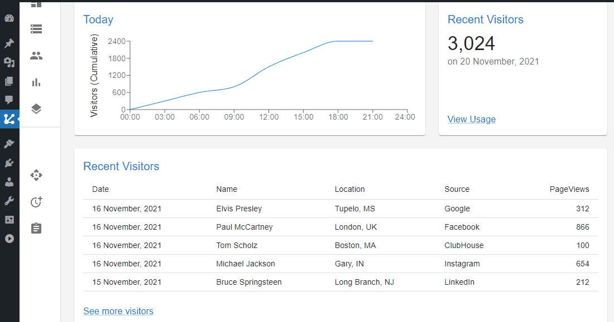
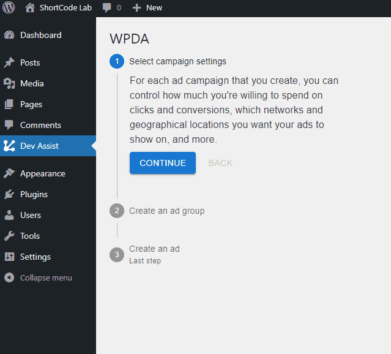

# WP Dev Assist

WordPress Developer Assistant Plugin. Assists your development efforts with WordPress. Many tools to assist you as a WordPress developer. 

Frontend is build with React. WP REST API and WP AJAX is used as backend.

## About 

This plugin is a result of the challenges faced during another plugin development project. A user-friendly way to explore the WordPress internal environment was needed. More features will be added to the WP Dev Assist plugin as future projects require a more sophisticated exploration of WordPress internals.

# Dashboard



# Dev Assist Stepper

Demonstration of the stepper component.

See: ```src > components > VerticalStepper.js```

